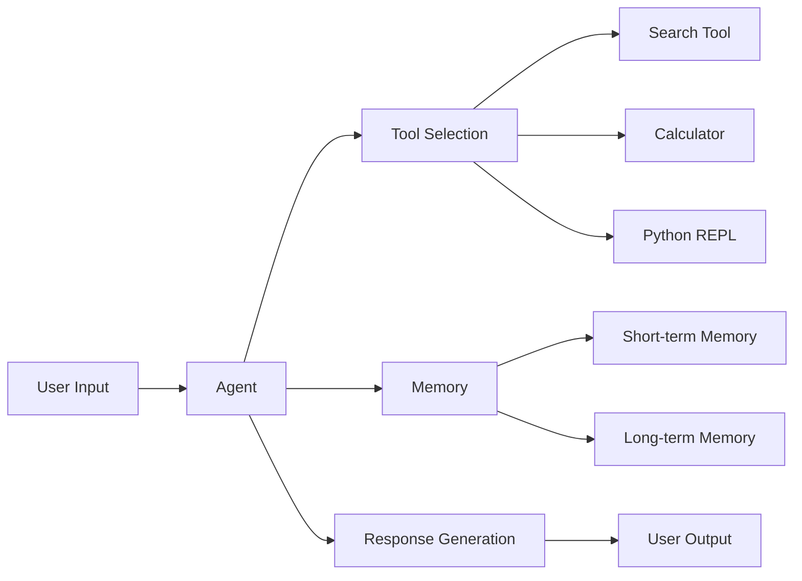

# Agentic-AI
🤖 Local-first AI assistant built with Streamlit, LangChain, and Ollama. Supports search, Python code execution, model switching (Mistral, LLaMA3, Gemma), memory window config, and privacy-first local processing. UI is simple, responsive, and chat-based.

# Task-Oriented AI Agent with LangChain and Ollama

This project implements a fully functional agentic AI system using LangChain and Ollama. It's designed to solve user-defined tasks through multi-step reasoning, tool usage, and memory management, all powered by local LLMs.

## Features

- **Local LLM Integration**: Uses Ollama to run various open-source models (Mistral, LLaMA3.2, Gemma)
- **Multi-Tool Integration**:
  - 🔍 Web Search (DuckDuckGo)
  - 🧮 Calculator (LLMMathChain)
  - 🐍 Python REPL (with safety restrictions)
- **Memory Systems**:
  - Short-term: ConversationBufferWindowMemory
  - Long-term: FAISS vector store (optional)
- **Web Interface**: Intuitive Streamlit-based UI with chat history
- **Advanced Features**:
  - Multi-turn conversations
  - Code execution with safety measures
  - Mathematical calculations
  - Web search capabilities

## Prerequisites

- Python 3.9+
- [Ollama](https://ollama.ai/) installed and running
- At least one LLM model downloaded (e.g., `ollama pull llama3.2`)
- Git (for cloning the repository)
- pip (Python package manager)

## 🚀 Quick Start

1. **Clone the repository:**
   ```bash
   git clone https://github.com/yourusername/langchain-agent.git
   cd langchain-agent
   ```

2. **Set up the environment:**
   ```bash
   # Create and activate virtual environment
   python -m venv venv
   # Windows:
   venv\Scripts\activate
   # macOS/Linux:
   # source venv/bin/activate
   ```

3. **Install dependencies:**
   ```bash
   py -m pip install -r requirements.txt
   ```

4. **Download a model (if not already done):**
   ```bash
   ollama pull llama3.2  # or any other supported model
   ```

5. **Run the application:**
   ```bash
   py -m streamlit run main_agent.py
   ```
   The app will be available at `http://localhost:8501`

## 🛠️ Implementation Details

### Agent Architecture



### Tool Integration

1. **Search Tool (DuckDuckGo)**
   - No API key required
   - Used for real-time information retrieval
   - Handles web searches and information lookups

2. **Calculator (LLMMathChain)**
   - Handles mathematical expressions
   - Uses SymPy for symbolic mathematics
   - Safe execution environment

3. **Python REPL**
   - Executes Python code
   - Safety restrictions in place
   - Timeout protection
   - Blocked operations (file system, network, etc.)

### Memory System

- **Short-term Memory**: `ConversationBufferWindowMemory`
  - Maintains context of recent conversation
  - Configurable window size (default: 5 messages)
  - Prevents context window overflow

- **Long-term Memory** (Optional)
  - FAISS vector store for persistent memory
  - Stores and retrieves relevant past interactions
  - Uses sentence-transformers for embeddings

## ⚙️ Configuration

### Model Selection

Change the default model in the Streamlit UI sidebar or modify `main_agent.py`:

```python
llm = ChatOllama(
    model="llama3.2",  # Change to your preferred model
    temperature=0.2,  # Adjust creativity (0.0 to 1.0)
    num_ctx=2048,    # Context window size
    num_gpu_layers=0, # GPU layers (if available)
    num_thread=4,    # CPU threads
    top_k=40,        # Top-k sampling
    top_p=0.9,       # Nucleus sampling
    repeat_penalty=1.1
)
```

### Available Models

Any model supported by Ollama can be used. Popular choices include:
- `mistral` - Good balance of speed and quality
- `llama3.2` - Meta's latest model
- `gemma` - Google's lightweight model

List available models:
```bash
ollama list
```

### Memory Configuration

Adjust memory settings in the Streamlit UI or modify `main_agent.py`:
- **Memory Window**: Number of recent messages to remember
- **Temperature**: Controls response randomness (0.0 to 1.0)

## 🧪 Evaluation & Testing

### Test Cases

The agent has been tested with various queries including:
1. **Information Retrieval**:
   - "What's the latest news about AI?"
   - "Tell me about quantum computing"

2. **Mathematical Operations**:
   - "Calculate 45 * 89 + (32 / 8)"
   - "What's the square root of 625?"

3. **Code Execution**:
   - "Write a Python function to calculate factorial"
   - "Show me how to sort a dictionary by value"

### Performance Metrics

- Accuracy: High for factual queries with web search
- Limitations: May struggle with very recent events or specialized knowledge

## Sample ScreenShots


## 🐛 Known Issues & Limitations

- First response might be slow as the model warms up
- Complex queries may time out (currently set to 30s)
- Limited context window affects long conversations
- Some mathematical expressions might be misinterpreted

## 🔧 Troubleshooting

### Common Issues

1. **Agent not responding**
   - Ensure Ollama is running: `ollama serve`
   - Check model is downloaded: `ollama list`
   - Verify port 8501 is available

2. **Search not working**
   - Check internet connection
   - Verify DuckDuckGo is accessible

3. **Python REPL errors**
   - Some operations are restricted for security
   - Check error messages for blocked operations

### Getting Help

If you encounter issues:
1. Check the debug info in the sidebar
2. Look for error messages in the console
3. Open an issue on GitHub with details of the problem

## 📚 Documentation

### Project Structure

```
langchain-agent/
├── main_agent.py              # Main application code
├── requirements.txt    # Python dependencies
├── README.md          # This file
└── .gitignore         # Git ignore file
```

### Key Components

1. **main_agent.py**
   - Main Streamlit application
   - Agent initialization and configuration
   - UI components and event handling
   - Tool implementations

2. **requirements.txt**
   - Lists all Python dependencies
   - Pinned versions for reproducibility

## 🚀 Deployment

### Local Development

```bash
# Install dependencies
pip install -r requirements.txt

# Run the application
py -m streamlit run main_agent.py
```

### Production Deployment

For production use, consider:
1. Using a WSGI server like Gunicorn with a reverse proxy (Nginx/Apache)
2. Setting up a systemd service for the Ollama server
3. Implementing proper logging and monitoring

## 🤝 Contributing

Contributions are welcome! Please follow these steps:

1. Fork the repository
2. Create a feature branch
3. Commit your changes
4. Push to the branch
5. Create a Pull Request

## 📝 License

This project is open source and available under the [MIT License](LICENSE).

## 🙏 Acknowledgments

- [LangChain](https://python.langchain.com/) for the agent framework
- [Ollama](https://ollama.ai/) for local LLM support
- [Streamlit](https://streamlit.io/) for the web interface
- All open-source contributors and model creators
